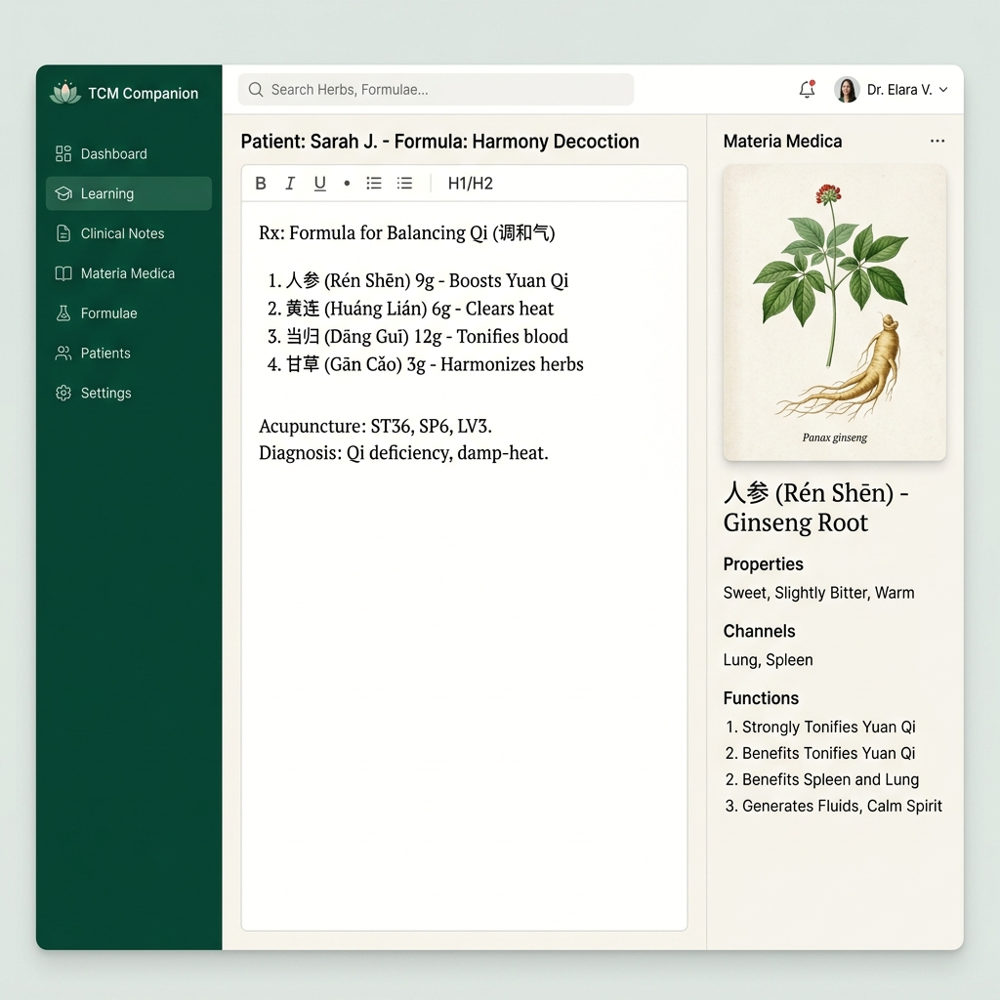

# 一味坚持 (TCM Companion) 🌿



**一味坚持** 是一款专为中医从业者、学生及爱好者设计的私人化临床记录与药理学习工具。它结合了现代化的交互设计与中医美学，旨在通过 AI 赋能与本地隐私保护，构建一个高效、优雅的诊疗辅助与知识管理平台。

## ✨ 核心特性

- **📝 全能临床笔记**：支持“临床日记”、“学习笔记”及“专业药方”三种模版。采用 ReactQuill 富文本编辑器，支持图片直接粘贴与图文混排。
- **🤖 AI 药理分析**：内置 AI 引擎（支持 Anthropic Claude, Gemini 及本地 Ollama 模型），自动识别笔记中的药材，并提供药性分析、组方解析及功效总结。
- **📚 智能中药图鉴**：自动从您的历史药方中收录药材，构建私人图鉴。支持查询药材的性味归经、经典配伍及临床应用。
- **🗃️ 药方自动归总**：智能聚合所有历史药方，支持按日期、药方名检索，点击即可快速预览方组详情，无需页面跳转。
- **🔒 极致隐私保护**：采用 `File System Access API`，所有诊疗数据直接存储在您的本地硬盘，无需上传云端，确保患者隐私绝对安全。
- **🖨️ 专业 PDF 导出**：一键生成纯净的处方/笔记页面，自动优化打印排版，隐藏侧边栏及冗余 UI，适合打印分发或存档。

## 🛠️ 技术栈

- **前端**: React 18, Vite, TypeScript
- **动画**: Framer Motion (motion/react)
- **图标**: Lucide React
- **编辑器**: ReactQuill
- **存储**: Local File System API
- **AI 代理**: Node.js Proxy Server

## 🚀 快速开始

### 1. 克隆项目
```bash
git clone https://github.com/kisetsu233/chinese-medicine-learning-app.git
cd chinese-medicine-learning-app
```

### 2. 安装依赖
```bash
npm install
```

### 3. 配置环境
复制 `.env.example` 为 `.env` 并填入您的 API 密钥：
```env
ANTHROPIC_API_KEY=your_key_here
```

### 4. 启动开发服务器
```bash
# 启动 AI 代理服务器
npm run server

# 启动前端应用
npm run dev
```

## 🎨 设计理念

本应用深度遵循**极简主义**与**中医美学**。配色采用“翡翠绿”搭配“宣纸白”，UI 布局借鉴了经典医籍的排版逻辑，结合现代化的玻璃拟态（Glassmorphism）与丝滑的微动画，旨在让诊疗记录过程成为一种享受。

---

*坚持一味，医道随行。*
